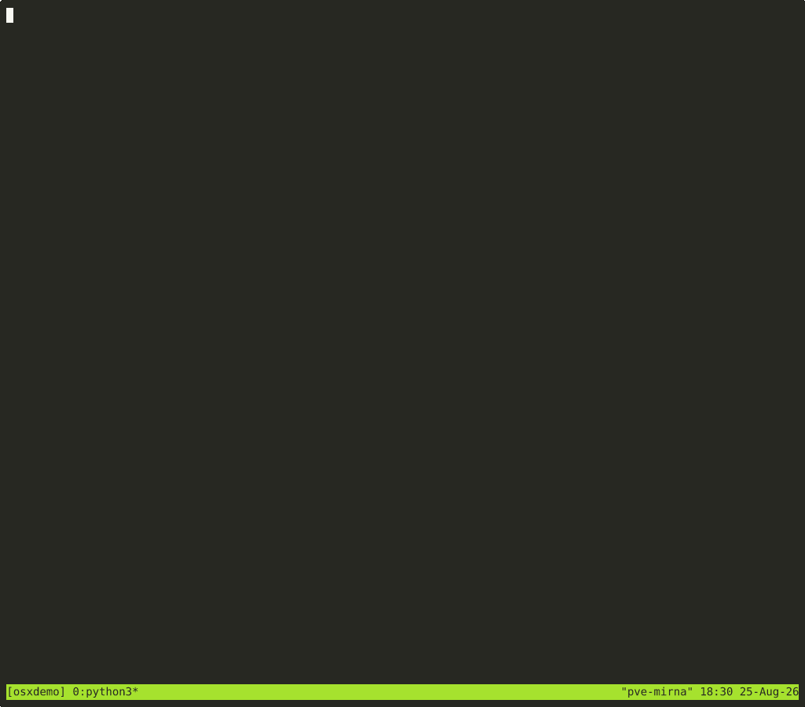
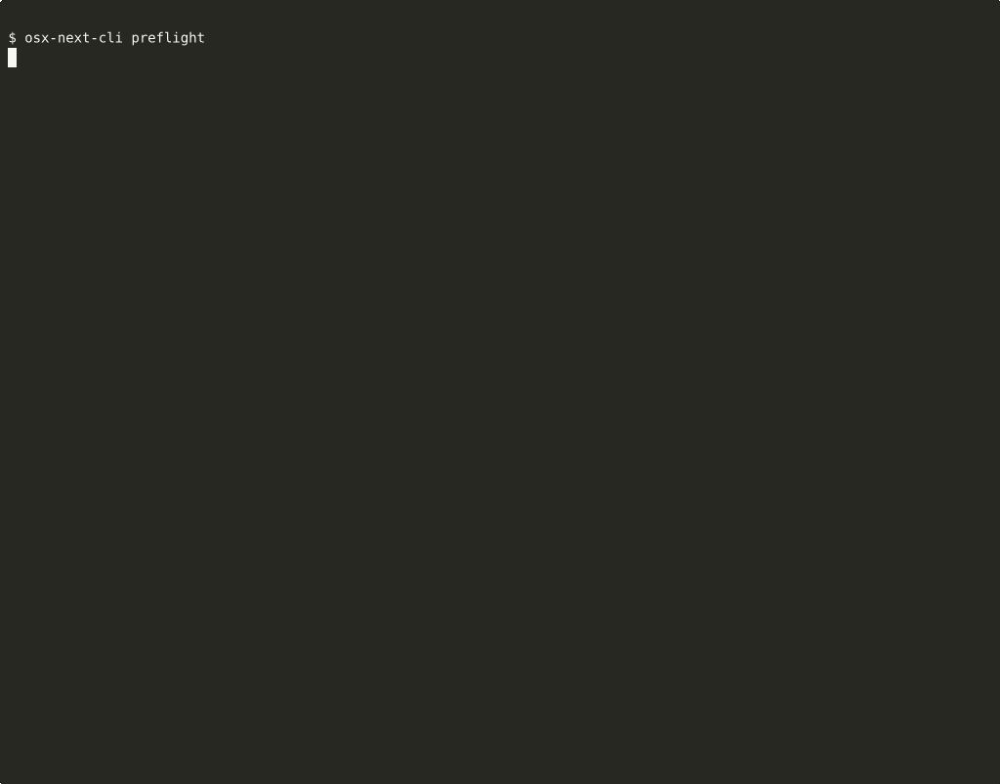
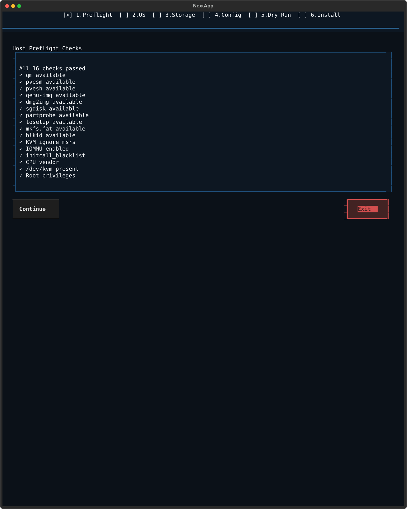
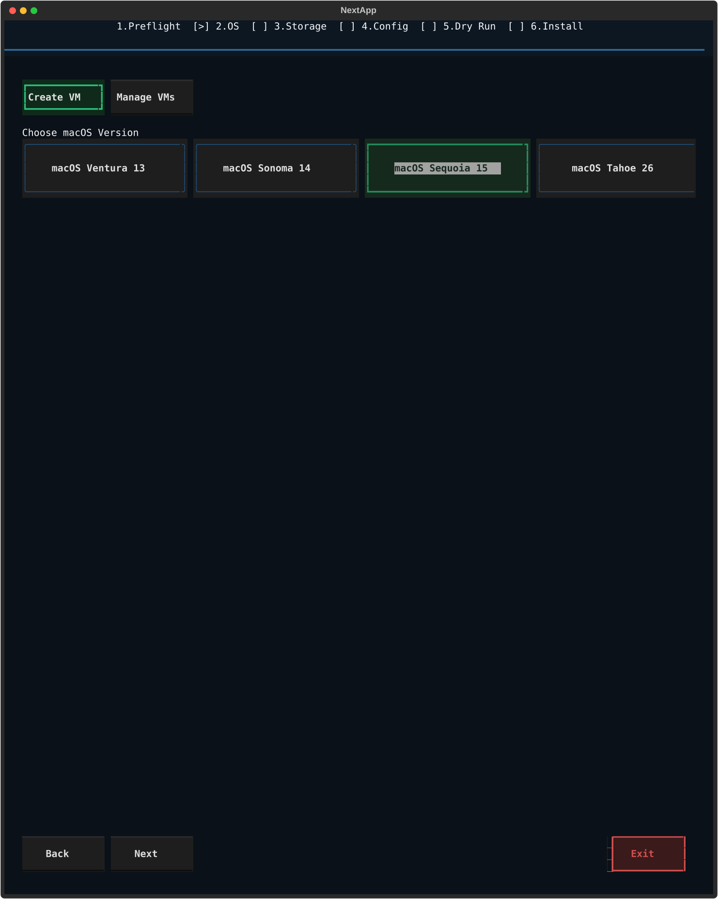
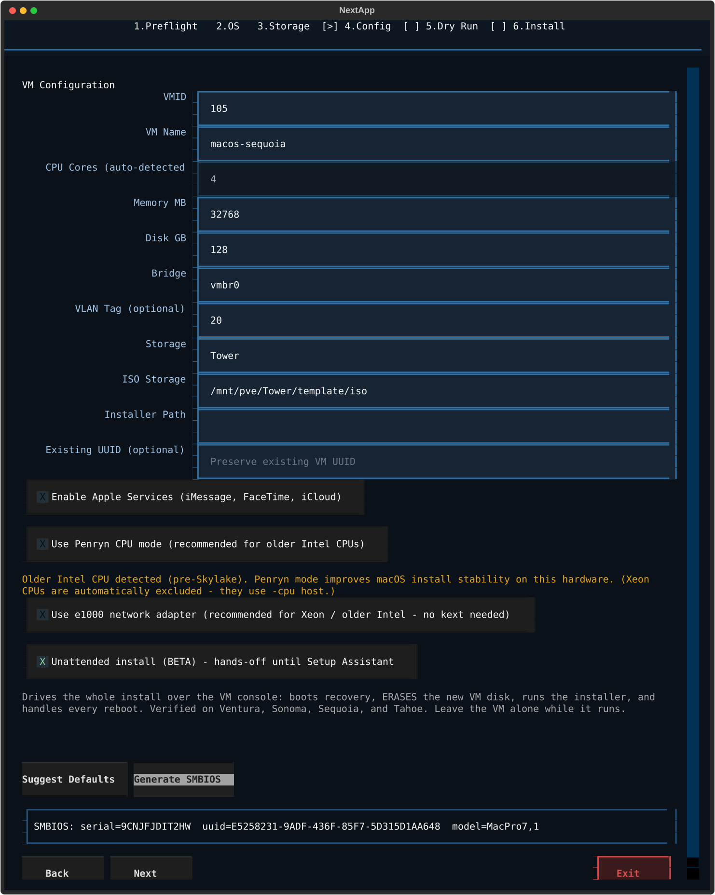
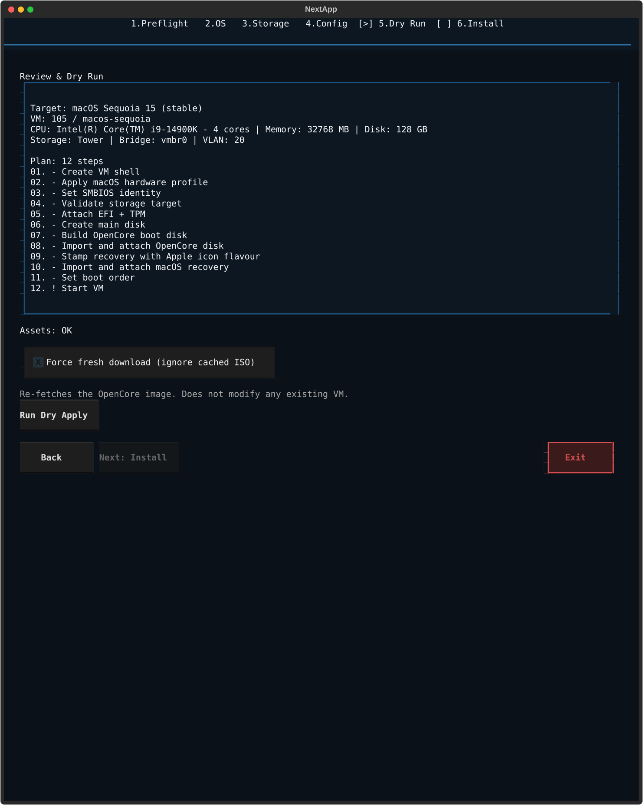
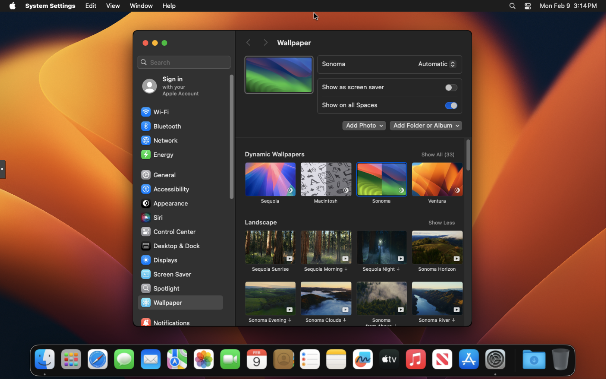

<h1 align="center">
  <br>
  🍏 OSX Proxmox Next
  <br>
</h1>

<p align="center">
  <strong>You're losing 3–6 hours every time you set up a macOS VM on Proxmox.</strong><br>
  OpenCore plist editing. GenSMBIOS. Manual <code>qm</code> commands. One wrong flag and you start over.<br>
  <strong>osx-proxmox-next does it in under 5 minutes. One command. Guided wizard. Done.</strong>
</p>

<p align="center">
  <a href="https://github.com/lucid-fabrics/osx-proxmox-next/actions/workflows/test.yml">
    
  </a>
  <a href="https://github.com/lucid-fabrics/osx-proxmox-next">
    
  </a>
  
  <a href="https://discord.gg/Ub6TunHYre">
    
  </a>
  <a href="https://lucid-fabrics.github.io/osx-proxmox-next/">
    
  </a>
  <a href="https://ko-fi.com/s/84fe857595">
    
  </a>
  <a href="https://buymeacoffee.com/lucidfabrics">
    
  </a>
</p>

<p align="center">
  <a href="https://ko-fi.com/s/84fe857595">
    
  </a>
</p>

---

## 🧰 Stop Wasting Afternoons on macOS VMs

The manual route eats your time: find the right OpenCore build, edit plist files, run GenSMBIOS, copy ISOs, type out `qm` commands, debug boot failures, repeat. Most people give up or spend a full day getting it right once - then forget the steps by the next time.

osx-proxmox-next replaces all of it with a 6-step wizard that runs on your Proxmox host.

**You get:**
- A 6-step TUI wizard: **Preflight > OS > Storage > Config > Dry Run > Install**
- Auto-detected hardware defaults (CPU vendor, cores, RAM, storage targets)
- Intel, Xeon, and AMD CPU support - auto-detected, zero configuration needed
- Automatic OpenCore and recovery/installer download - no manual file placement
- Shared storage support - download ISOs to NAS or any Proxmox storage pool (`--iso-dir`)
- Auto-generated SMBIOS identity (serial, UUID, model) - no OpenCore editing needed
- Graphical boot picker with Apple icons - auto-boots the installer
- Mandatory dry-run before live install previews every command
- Real-time form validation with inline error feedback

### How It Compares

| | Manual setup | osx-proxmox-next |
|---|---|---|
| Time to first boot | 3–6 hours | < 5 minutes |
| OpenCore setup | Edit plist files by hand | Automatic |
| SMBIOS generation | External tool (GenSMBIOS) | Built-in, zero config |
| Apple Services | Manual identity chain | One flag: `--apple-services` |
| Tahoe 26 | Community trial & error | Supported |
| Dry-run preview | Never | Always - see every `qm` command first |
| Scripting / CI | Never | Full CLI + JSON export |
| Post-install health check | Never | `osx-next-cli doctor --vmid <id>` |

<p align="center">
  <strong>If this already looks better than what you've been doing - ⭐ star the repo and help others find it.</strong><br><br>
  <a href="https://ko-fi.com/s/84fe857595">
    
  </a>
  &nbsp;&nbsp;
  <a href="https://github.com/sponsors/lucid-fabrics">
    
  </a>
</p>

### Demo

**Wizard (6 steps: Preflight → OS → Storage → Config → Dry Run → Install):**



**CLI tools (preflight, plan, doctor):**



### TUI Preview

<table>
  <tr>
    <td align="center">
      <br>
      <strong>Step 1:</strong> Preflight Checks
    </td>
    <td align="center">
      <br>
      <strong>Step 2:</strong> OS Selection
    </td>
  </tr>
  <tr>
    <td align="center">
      <br>
      <strong>Step 3:</strong> VM Configuration
    </td>
    <td align="center">
      <br>
      <strong>Step 4:</strong> Review & Dry Run
    </td>
  </tr>
</table>



> **Note:** Dynamic wallpapers are known to not display correctly without GPU passthrough on VNC. Use a static wallpaper instead.

<p align="center">
  Built solo, maintained in free time. If it saved you an afternoon:<br><br>
  <a href="https://ko-fi.com/s/84fe857595">
    
  </a>
  &nbsp;&nbsp;
  <a href="https://buymeacoffee.com/lucidfabrics">
    
  </a>
</p>

---

## 🚀 Quick Start

Run this on your Proxmox 9 host as root:

```bash
bash -c "$(curl -fsSL https://raw.githubusercontent.com/lucid-fabrics/osx-proxmox-next/main/install.sh)"
```

This clones the repo, sets up a Python venv, and launches the TUI wizard.

> Built solo and maintained in my free time. If it saves you an afternoon of `qm` commands, [a coffee helps](https://ko-fi.com/s/84fe857595) or a [coffee on BMC](https://buymeacoffee.com/lucidfabrics). ☕

### 🐚 Bash Alternative

Prefer a standalone bash script with no Python dependency?

```bash
bash -c "$(curl -fsSL https://raw.githubusercontent.com/lucid-fabrics/osx-proxmox-next/main/scripts/bash/osx-proxmox-next.sh)"
```

Same VM creation logic (OpenCore + osrecovery + SMBIOS), whiptail menus, no venv needed.

### 🪄 Wizard Walkthrough

| Step | What Happens |
|------|-------------|
| **1️⃣ Preflight** | Auto-detects CPU vendor (Intel/AMD), checks host readiness |
| **2️⃣ Choose OS** | Pick macOS version (Ventura, Sonoma, Sequoia, Tahoe) - SMBIOS auto-generated |
| **3️⃣ Storage** | Select storage target from auto-detected Proxmox storage pools |
| **4️⃣ Config** | Review/edit VM settings (VMID, cores, memory, disk) with auto-filled defaults |
| **5️⃣ Dry Run** | Auto-downloads missing assets, then previews every `qm` command |
| **6️⃣ Install** | Creates the VM, builds OpenCore, imports disks, and starts the VM |

**Most users:** pick your macOS version, pick your storage, click through to **Install**. Preflight and CPU detection run automatically.

> **Smart caching:** OpenCore and recovery images are downloaded once and reused across VM installs. Creating a second Sonoma VM? No re-download needed. Use `--iso-dir` on shared storage to cache across Proxmox nodes.

---

## 📋 Requirements

### Hardware

| Component | Minimum | Recommended |
|-----------|---------|-------------|
| CPU | 4 cores (power of 2), VT-x/AMD-V (Intel or AMD) | 8+ cores |
| RAM | 8 GB host (4 GB to VM) | 16+ GB host |
| Storage | 64 GB free | 128+ GB SSD/NVMe |
| GPU | Integrated | Discrete (for passthrough) |

> **AMD CPUs** are fully supported. The tool auto-detects your CPU vendor and applies the correct configuration (Cascadelake-Server emulation for AMD, native host passthrough for Intel). **Xeon and pre-Skylake Intel CPUs** are also handled automatically: most Xeons stay on `-cpu host`, real HEDT chips (Xeon E5/E7 v2-v4, dual-socket/multi-die parts) get a fixed emulated CPU model instead, since `-cpu host` leaks their genuine multi-package topology and can livelock macOS's scheduler during install. Older consumer Intel gets Penryn mode, and non-HEDT Xeon/legacy Intel get `e1000` instead of `vmxnet3` for reliable network during installation.

### CPU Compatibility

| CPU Type | Support | QEMU Mode | NIC |
|----------|---------|-----------|-----|
| Modern Intel (Skylake+) | Full | `-cpu host` (native passthrough) | vmxnet3 |
| Intel Xeon (non-HEDT) | Full | `-cpu host` (native passthrough) | e1000 |
| Intel Xeon E5/E7 v2-v4 (HEDT, dual-socket) | Full | Fixed emulated model (Broadwell-noTSX / Haswell-noTSX) | e1000 |
| Pre-Skylake Intel (Broadwell, Haswell, etc.) | Full | Penryn mode | e1000 |
| AMD (any) | Full | Cascadelake-Server emulation | vmxnet3 |
| Apple Silicon (ARM Proxmox) | Not supported | n/a | n/a |

All modes are auto-detected. Zero configuration needed.

### Host

- Proxmox VE 9 with root shell access
- Internet access (for bootstrap + dependencies)
- ISO storage available (e.g. `/var/lib/vz/template/iso` or shared NAS via `/mnt/pve/*/template/iso`)

### TSC Check (Recommended)

Stable TSC flags reduce clock drift and VM lag. Check with:

```bash
lscpu | grep -E 'Model name|Flags'
```

Look for `constant_tsc` and `nonstop_tsc` in the output.

---

## 🍎 Supported macOS Versions

| macOS | Channel | Apple Services | Notes |
|-------|---------|---------------|-------|
| **Ventura 13** | ✅ Stable | ✅ Works | Lightweight, great for older hardware |
| **Sonoma 14** | ✅ Stable | ✅ Works | Best tested, most reliable |
| **Sequoia 15** | ✅ Stable | 🧪 Community-tested | Kernel patch applied automatically with `--apple-services` |
| **Tahoe 26** | ✅ Stable | 🧪 Community-tested | Kernel patch applied automatically with `--apple-services` |

> **Apple Services on Sequoia/Tahoe VMs:** This tool automatically applies a kernel-level patch when `--apple-services` is enabled. The patch redirects Apple's VM detection sysctl (`hv_vmm_present`) to read from the hibernate counter (always 0), so Apple's DeviceCheck sees a physical machine and allows Apple ID sign-in. Verified working on Sequoia 15 and Tahoe 26. See the [Apple Services section](#-enable-apple-services-icloud-imessage-facetime) for details.

---

## ⌨️ CLI Usage

For scripting or headless use, the CLI bypasses the TUI entirely:

```bash
# Show version
osx-next-cli --version

# Download OpenCore + recovery images
osx-next-cli download --macos ventura

# Re-download the OpenCore ISO, ignoring any cached copy
osx-next-cli download --macos ventura --force

# Check host readiness
osx-next-cli preflight

# Preview commands (dry run) - SMBIOS identity auto-generated
osx-next-cli apply \
  --vmid 910 --name macos-sequoia --macos sequoia \
  --cores 8 --memory 16384 --disk 128 \
  --bridge vmbr0 --storage local-lvm

# Execute for real
osx-next-cli apply --execute \
  --vmid 910 --name macos-sequoia --macos sequoia \
  --cores 8 --memory 16384 --disk 128 \
  --bridge vmbr0 --storage local-lvm

# Enable verbose kernel log (shows text instead of Apple logo during boot)
osx-next-cli apply --execute --verbose-boot \
  --vmid 910 --name macos-sequoia --macos sequoia \
  --cores 8 --memory 16384 --disk 128 \
  --bridge vmbr0 --storage local-lvm

# Use shared NAS storage for ISO/recovery images
osx-next-cli apply --execute \
  --vmid 910 --name macos-sequoia --macos sequoia \
  --cores 8 --memory 16384 --disk 128 \
  --bridge vmbr0 --storage local-lvm \
  --iso-dir /mnt/pve/nas/template/iso

# Skip SMBIOS generation entirely
osx-next-cli apply --no-smbios \
  --vmid 910 --name macos-sequoia --macos sequoia \
  --cores 8 --memory 16384 --disk 128 \
  --bridge vmbr0 --storage local-lvm

# Provide your own SMBIOS values
osx-next-cli apply --execute \
  --vmid 910 --name macos-sequoia --macos sequoia \
  --cores 8 --memory 16384 --disk 128 \
  --bridge vmbr0 --storage local-lvm \
  --smbios-serial C02G3050P7QM --smbios-uuid "$(uuidgen)" \
  --smbios-model MacPro7,1

# Enable Apple Services (iMessage, FaceTime, iCloud)
osx-next-cli apply --execute \
  --vmid 910 --name macos-sequoia --macos sequoia \
  --cores 8 --memory 16384 --disk 128 \
  --bridge vmbr0 --storage local-lvm \
  --apple-services

# Export plan as JSON (for scripting / CI integration)
osx-next-cli plan --json \
  --vmid 910 --name macos-sequoia --macos sequoia \
  --cores 8 --memory 16384 --disk 128 \
  --bridge vmbr0 --storage local-lvm

# Destroy a VM (dry run - preview commands)
osx-next-cli uninstall --vmid 910

# Destroy a VM (execute for real, including disk images)
osx-next-cli uninstall --vmid 910 --purge --execute

# Edit an existing VM (dry run - preview commands)
osx-next-cli edit --vmid 910 --cores 4 --memory 8192

# Edit an existing VM (rename + extend disk, execute for real)
osx-next-cli edit --vmid 910 --name macos-sequoia-v2 --add-disk 64 --execute

# Edit an existing VM (change bridge, preserve existing NIC model and MAC)
osx-next-cli edit --vmid 910 --bridge vmbr1 --execute

# Edit an existing VM (change bridge with explicit NIC model)
osx-next-cli edit --vmid 910 --bridge vmbr1 --nic-model e1000 --execute

# Edit and restart VM automatically after changes
osx-next-cli edit --vmid 910 --cores 8 --memory 16384 --start --execute

# Clone a VM with a fresh SMBIOS identity (dry run - preview commands)
osx-next-cli clone --source-vmid 910 --new-vmid 911 --name macos-sequoia-clone

# Clone and execute (regenerates serial, UUID, MLB, ROM, vmgenid - both VMs stay independent on Apple services)
osx-next-cli clone --source-vmid 910 --new-vmid 911 --name macos-sequoia-clone --execute

# Clone with explicit macOS version hint
osx-next-cli clone --source-vmid 910 --new-vmid 911 --macos sonoma --execute

# Clone without Apple services identity reset
osx-next-cli clone --source-vmid 910 --new-vmid 911 --no-apple-services --execute

# Diagnose a VM for common config issues (balloon, machine type, cores, NIC, SMBIOS, boot order…)
osx-next-cli doctor --vmid 910
```

---

## 🔧 Troubleshooting

Not sure what's wrong? Run the VM health check first:

```bash
osx-next-cli doctor --vmid <your-vmid>
```

It checks balloon driver, machine type, CPU config, NIC model, SMBIOS, boot order, disk layout, and more - and prints a fix command for every failure it finds.

---

<details>
<summary><strong>macOS installer doesn't show my disk</strong></summary>

In the macOS installer:
1. Open **Disk Utility**
2. Click **View > Show All Devices**
3. Select **QEMU VirtIO Block Device**
4. Erase with format **APFS** and scheme **GUID Partition Map**
5. Close Disk Utility and continue installation
</details>

<details>
<summary><strong>Live apply is blocked - missing assets</strong></summary>

The tool requires OpenCore and recovery/installer images. It scans `/var/lib/vz/template/iso` and `/mnt/pve/*/template/iso` for:
- `opencore-osx-proxmox-vm.iso` or `opencore-{version}.iso`
- `{version}-recovery.img` or `{version}-recovery.iso`

Use `osx-next-cli download --macos <version>` to auto-fetch missing assets. The TUI wizard auto-downloads missing assets in step 5.
</details>

<details>
<summary><strong>I see UEFI Shell instead of macOS boot</strong></summary>

Boot media path or order mismatch. Ensure OpenCore is on `ide0` and recovery on `ide2`, with boot order set to `ide2;virtio0;ide0`.
</details>

<details>
<summary><strong>Loops back to Recovery after the install finishes</strong></summary>

The install succeeded but OpenCore is still booting the on-disk Recovery volume. macOS only sets the startup disk once it boots the new system for real, and it never got there, so the bootloader keeps falling back to Recovery. `post-install` only reorders the Proxmox boot devices, it cannot change the bootloader's saved choice inside the VM.

Fix it from the VM console:

1. Reboot and wait for the OpenCore picker (the screen with the disk icons).
2. Press **spacebar** to reveal all entries, select **macOS** (not "Install macOS" or "Recovery"), and boot it.
3. Optionally press **Ctrl+Enter** on that entry to make it the default so the choice sticks.
4. If it still returns to Recovery, pick **Reset NVRAM** in the picker first, reboot, then select **macOS** again.

Once macOS reaches the Setup Assistant and you finish setup, later boots go straight to macOS.
</details>

<details>
<summary><strong>"Guest has not initialized the display"</strong></summary>

Boot/display profile mismatch during early boot. Use `vga: std` for stable noVNC during installation.
</details>

<details>
<summary><strong>macOS is slow on AMD CPU</strong></summary>

Expected behavior. AMD hosts use `Cascadelake-Server` CPU emulation instead of native passthrough (`-cpu host`). This adds overhead but is required for macOS compatibility. Intel hosts get native performance.
</details>

<details>
<summary><strong>Stuck on Apple logo (no progress, flat CPU)</strong></summary>

macOS requires power-of-2 CPU core counts (2, 4, 8, 16). Non-power-of-2 values like 6 or 12 can cause the kernel to hang at the Apple logo. The tool defaults to safe values, but if you overrode the core count manually, try reducing to 4 or 8.
</details>

<details>
<summary><strong>I want to see verbose kernel log instead of Apple logo</strong></summary>

Use `--verbose-boot` flag in CLI: `osx-next-cli apply --verbose-boot ...`. This adds `-v` to OpenCore boot arguments. Useful for debugging boot issues.
</details>

---

## 🎮 GPU Passthrough

Host-side setup is manual and required before the VM can use a discrete GPU.

1. Enable **VT-d / IOMMU** in BIOS/UEFI
2. Add to kernel cmdline:
   - Intel: `intel_iommu=on iommu=pt`
   - AMD: `amd_iommu=on iommu=pt`
3. Bind GPU + GPU audio to `vfio-pci`
4. Reboot host
5. Attach both PCI functions to VM (`hostpci0`, `hostpci1`)

📖 Reference: [Proxmox PCI(e) Passthrough Wiki](https://pve.proxmox.com/wiki/PCI(e)_Passthrough)

---

## ⚡ Performance Tips

- Use **SSD/NVMe-backed storage** for VM disks
- Don't overcommit host CPU or RAM
- Keep the main macOS disk on `virtio0`, OpenCore on `ide0`, recovery on `ide2`
- Use `vga: std` during installation (switch after)
- Change one setting at a time and measure the impact
- **Intel CPUs** get native host passthrough, best performance
- **Xeon CPUs** get native host passthrough (same as modern Intel, Penryn is skipped), except real HEDT chips (E5/E7 v2-v4), which use a fixed emulated model to avoid a scheduler livelock
- **Pre-Skylake Intel** (Broadwell, Haswell, etc.) use Penryn mode with `e1000` NIC for install stability
- **AMD CPUs** use Cascadelake-Server emulation - functional but slower due to CPU translation overhead

---

## 🎛️ Guest Performance Profiles (Optional)

These are **optional shell scripts that run inside the macOS guest** to tune responsiveness. They are not part of this project and are not required - use them only if you understand what they change.

### Blazing Profile

Optimized for **maximum UI speed** in the VM. Best for general use where you want the snappiest experience.

| What It Changes | Setting |
|----------------|---------|
| UI animations | Disabled (window resize, Mission Control, Dock) |
| Transparency effects | Disabled (reduces compositing overhead) |
| Spotlight indexing | **Disabled** (`mdutil -a -i off`) - frees CPU/IO |
| Sleep on AC power | Disabled (sleep, display sleep, disk sleep, Power Nap all off) |
| Dock/Finder/SystemUIServer | Restarted to apply changes |

⚠️ **Trade-off:** No Spotlight search (Finder search, Siri suggestions, and in-app search won't index new files).

### Xcode Profile

Optimized for **development workflows** (Xcode, SourceKit, code search). Similar UI optimizations as Blazing, but keeps Spotlight alive.

| What It Changes | Setting |
|----------------|---------|
| UI animations | Disabled (same as Blazing) |
| Transparency effects | Disabled (same as Blazing) |
| Spotlight indexing | **Kept ON** - required for Xcode code completion and search |
| System sleep | Disabled, but display sleep is allowed (longer coding sessions) |
| Dock/Finder/SystemUIServer | Restarted to apply changes |

⚠️ **Trade-off:** Slightly more background CPU/IO from Spotlight, but Xcode features work fully.

### Which Profile Should I Use?

| Use Case | Profile |
|----------|---------|
| General browsing, testing apps | **Blazing** |
| Xcode / SwiftUI / iOS development | **Xcode** |
| Don't know / want defaults | **Neither** - skip this section |

### Usage

```bash
# Apply blazing profile
bash scripts/profiles/apply_blazing_profile.sh

# Revert to macOS defaults
bash scripts/profiles/revert_blazing_profile.sh

# Apply xcode profile
bash scripts/profiles/apply_xcode_profile.sh

# Revert to macOS defaults
bash scripts/profiles/revert_xcode_profile.sh
```

### Safety Notes

- **Snapshot your VM before applying** any profile
- Apply only one profile at a time
- Always keep the matching `revert_*` script ready
- These scripts accept an optional sudo password argument - avoid storing passwords in plain text

---

## ☁️ Enable Apple Services (iCloud, iMessage, FaceTime)

Apple services require a complete, consistent identity chain spanning both QEMU SMBIOS and OpenCore's EFI PlatformInfo - plus stable network/time configuration.

### How It Works

macOS validates Apple ID through two identity sources:

| Layer | What it provides | How it's set |
|-------|-----------------|--------------|
| **QEMU SMBIOS** | Serial, UUID, model visible to firmware | Proxmox `--smbios1` flag |
| **OpenCore PlatformInfo** | Serial, UUID, MLB, ROM visible to macOS | Patched into `config.plist` via `plistlib` |

Both must carry **identical values**. The ROM field must be derived from the NIC MAC address - macOS cross-checks ROM against the hardware NIC during Apple ID validation.

When `--apple-services` is enabled, this tool automatically:
1. Generates Apple-format SMBIOS identity (serial, UUID, MLB, ROM, model) - GenSMBIOS-compatible base-34 serials with valid manufacturing codes and checksummed MLB, no external binary needed
2. Generates a stable static MAC address for the NIC
3. Derives ROM from the MAC address (first 6 bytes, no colons)
4. Applies SMBIOS via Proxmox's `--smbios1` flag
5. Patches OpenCore's `config.plist` PlatformInfo with matching values
6. Adds a `vmgenid` device for Apple service stability

### SMBIOS Identity (Auto-Generated)

- **TUI:** SMBIOS is auto-generated when you select a macOS version in step 2. Click **Generate SMBIOS** in step 4 to regenerate.
- **CLI:** SMBIOS is auto-generated unless you pass `--no-smbios` or provide your own values via `--smbios-serial`, `--smbios-uuid`, `--smbios-mlb`, `--smbios-rom`, `--smbios-model`.
- **Existing UUID:** Enter an existing UUID in step 4 to preserve it (useful for re-running on an existing VM).

The generated values are visible in the dry-run output as a `qm set --smbios1` step.

### Usage

```bash
# Enable Apple Services (auto-generates identity + vmgenid + static MAC + PlatformInfo)
osx-next-cli apply --execute \
  --vmid 910 --name macos-sequoia --macos sequoia \
  --cores 8 --memory 16384 --disk 128 \
  --bridge vmbr0 --storage local-lvm \
  --apple-services

# With custom UUID (provide your own)
osx-next-cli apply --execute \
  --vmid 910 --name macos-sequoia --macos sequoia \
  --apple-services --smbios-uuid "YOUR-UUID-HERE"
```

In the **TUI**, check "Enable Apple Services (iMessage, FaceTime, iCloud)" in step 4 to add:
- `vmgenid` device (required for Apple services)
- Static MAC address (persistent across reboots)
- PlatformInfo patching in OpenCore's `config.plist`

### Post-Install Steps

1. **Verify** NVRAM is writable and persists across reboots
2. **Boot macOS** and confirm date/time are correct and network/DNS works
3. **Sign in order:** Apple ID (System Settings) first, then Messages, then FaceTime
4. **Reboot** once after login to confirm session persistence

### Checklist

- [x] SMBIOS values are unique to this VM (auto-generated)
- [x] MAC address is stable (auto-generated with `--apple-services`)
- [x] ROM derived from NIC MAC (auto-configured with `--apple-services`)
- [x] OpenCore PlatformInfo matches SMBIOS (auto-patched with `--apple-services`)
- [x] vmgenid is configured (auto-generated with `--apple-services`)
- [ ] Same OpenCore EFI is always used
- [ ] NVRAM reset is not triggered on every boot

### Common Issues

| Problem | Fix |
|---------|-----|
| "This Mac cannot connect to iCloud" | Recheck serial/MLB/UUID/ROM uniqueness. Sign out, reboot, sign in again. |
| "iMessage activation failed" | Verify ROM matches NIC MAC and MAC is static. Check date/time sync. |
| Works once then breaks | VM config is regenerating SMBIOS or NIC MAC between boots. |
| PlatformInfo not applied | Ensure `--apple-services` flag is set. Check OpenCore config.plist for PlatformInfo section. |
| "Verification Failed" on Sequoia/Tahoe | Ensure `--apple-services` is set - the kernel patch is applied automatically. If still failing, reboot once after first sign-in attempt. |

> **Note:** This tool configures all identity fields automatically, but Apple controls service activation server-side. Even with a correct setup, activation may require multiple attempts or a call to Apple Support. Never share SMBIOS values publicly or reuse them across VMs.

### Sequoia/Tahoe Apple ID - Kernel Patch Fix

Starting with macOS Sequoia 15, Apple's DeviceCheck reads `hv_vmm_present` from the kernel sysctl table to detect VMs and block Apple ID sign-in. The error appears as:

```
Verification Failed - An unknown error occurred.
```

**This tool fixes it automatically.** When `--apple-services` is enabled, a kernel-level OpenCore patch is injected into `config.plist` that redirects the `hv_vmm_present` sysctl lookup to read from `hibernatecount` instead (always 0 = not a VM). Apple's DeviceCheck sees a physical machine and allows sign-in.

**Community-attested:** Multiple testers have reported Apple ID, iCloud, iMessage, and FaceTime working on Sequoia 15 and Tahoe 26 with this patch. Results may vary - if it works for you, consider sharing your experience on [Discord](https://discord.gg/Ub6TunHYre).

> `RestrictEvents.kext` with `revpatch=sbvmm` alone does **not** fix this - that only hides `kern.hv_vmm_present` from userspace. The kernel patch operates at the sysctl string table level, which is what Apple's attestation stack reads directly.

**If sign-in still fails after applying the patch:**
1. Reboot the VM once - the patch requires a clean boot to take effect
2. Verify `--apple-services` was set during VM creation
3. As a last resort: create a **Sonoma 14** VM, sign in, then upgrade in-place to Sequoia/Tahoe

---

## 📂 Project Layout

```
src/osx_proxmox_next/
  app.py              # TUI wizard (Textual) - 6-step reactive state machine
  cli.py              # Non-interactive CLI
  domain.py           # VM config model + validation (VmConfig, EditChanges, PlanStep)
  planner.py          # qm command generation (build_plan, build_edit_plan)
  executor.py         # Dry-run and live execution engine
  assets.py           # OpenCore/installer ISO detection
  downloader.py       # Auto-download OpenCore + recovery images
  defaults.py         # Host-aware hardware defaults
  preflight.py        # Host capability checks
  rollback.py         # VM snapshot/rollback hints
  smbios.py           # SMBIOS identity generation (serial, UUID, MLB, ROM, model)
  smbios_planner.py   # SMBIOS PlanStep builder
  profiles.py         # VM config profile management
  infrastructure.py   # Proxmox command adapter
  diagnostics.py      # Diagnostic log bundle export
  _wizard_mixin.py    # TUI mixin: VM creation wizard steps
  _edit_mixin.py      # TUI mixin: VM edit flow (stop, patch, optionally restart)
  _manage_mixin.py    # TUI mixin: VM list, edit, and destroy in manage mode
  models/             # WizardState dataclass and related models
  services/           # Detection, edit, and Proxmox query services
  forms/              # Textual form widgets
  screens/            # TUI screen components (step screens, manage screen)
  py.typed            # PEP 561 type marker
```

---

## 🪝 Git Hooks

```bash
bash scripts/setup-hooks.sh
```

Enables pre-commit, commit-msg, and pre-push hooks for:
- **Commit message validation** - enforces [conventional commits](https://www.conventionalcommits.org/) format
- **Secret detection** - blocks hardcoded passwords, API keys, tokens
- **Code quality warnings** - flags TODO/FIXME and debug `print()` statements

---

## ❓ FAQ

### Can I pass through an NVIDIA GeForce GPU?

No, not on any modern macOS. Apple dropped NVIDIA support years ago, and it never came back.

| Architecture | Cards | Last macOS that worked |
|---|---|---|
| Kepler | GTX 600 / 700 | Big Sur 11 (native drivers) |
| Maxwell | GTX 900 | High Sierra 10.13.6 (Web Drivers) |
| Pascal | GTX 10-series, Titan Xp | High Sierra 10.13.6 (Web Drivers) |
| Turing and newer | RTX 20 / 30 / 40 | Never supported |

The newest GeForce card that ever ran on macOS was a **Pascal GTX 10-series**, and only up to **High Sierra**. NVIDIA's Web Drivers were never approved for Mojave or later, so anything Maxwell or newer is capped there. Kepler lasted longer only because real Macs shipped with it.

For GPU passthrough on a current macOS guest (Ventura, Sonoma, Sequoia, Tahoe), use an **AMD** card instead. Polaris (RX 470/480/580), Vega, and Navi (RX 5000/6000) have native macOS drivers and work with WhateverGreen, which ships in the OpenCore image.

### Why does macOS show "Memory Modules Misconfigured"?

This is cosmetic and specific to the `MacPro7,1` SMBIOS. macOS knows the real Mac Pro has 12 RAM slots and expects them filled in groups, so a VM's flat memory layout trips the warning. Nothing is actually wrong with the VM.

**VMs created from v0.26 onward are fixed automatically.** The OpenCore disk build now injects [RestrictEvents.kext](https://github.com/acidanthera/RestrictEvents), whose default `revblock=auto` setting blocks the `MemorySlotNotification` and `ExpansionSlotNotification` processes that produce the warning. No boot-arg is required.

> Earlier versions of this FAQ suggested `revpatch=memtab`. That value only enables the Memory tab on MacBookAir SMBIOS models and does nothing on `MacPro7,1`, so skip it. The process blocking that removes the warning is on by default once the kext is present.

For a VM created before v0.26, fix it in place:

1. Shut down the VM and back it up.
2. Mount partition 1 of the OpenCore disk (the small `ide0` disk) on the Proxmox host.
3. Download the [RestrictEvents release zip](https://github.com/acidanthera/RestrictEvents/releases) and copy `RestrictEvents.kext` into `EFI/OC/Kexts/`.
4. Add a `Kernel > Add` entry in `config.plist` with `BundlePath` `RestrictEvents.kext`, `ExecutablePath` `Contents/MacOS/RestrictEvents`, `PlistPath` `Contents/Info.plist`, `Enabled` `True`. Keep `Lilu.kext` above it in the list.
5. Unmount, boot, then dismiss any old copy of the warning still sitting in Notification Center. Blocking stops new notifications but does not clear ones already delivered.

Avoid changing the SMBIOS model to dodge the warning if you already have iCloud/iMessage working, since those are bound to the `MacPro7,1` identity.

### My desktop wallpaper is white or blank

This usually means macOS is running without GPU acceleration (the default `vga: std` framebuffer). Dynamic wallpapers in particular do not render in software mode. Pass through a supported AMD GPU for full acceleration, or pick a static wallpaper.

### The CLI keeps using an old OpenCore image

The OpenCore ISO is cached on disk and reused on every run. To pull a fresh copy, force it:

```bash
osx-next-cli download --macos <version> --force
```

In the TUI, tick **Force fresh download (ignore cached ISO)** on the Review step. Note this only refreshes the image for new installs; it does not modify the EFI of a VM you already created.

---

## 🔮 Roadmap

- 🧩 **Multi-VM templates** - save and reuse configurations across VMs
- 🔄 **Auto-update OpenCore** - detect and pull latest OpenCore releases
- 🎮 **GPU passthrough wizard** - guided IOMMU + VFIO setup *(unlocks at $1000 raised - see badge above)*

---

## 💖 Supporters

This project is free and open source. Sponsors keep it alive and shape what gets built next.

<p align="center">
  <a href="https://github.com/sponsors/lucid-fabrics">
    
  </a>
  &nbsp;
  <a href="https://buymeacoffee.com/lucidfabrics">
    
  </a>
  &nbsp;
  <a href="https://ko-fi.com/s/84fe857595">
    
  </a>
  &nbsp;
  <a href="https://discord.gg/Ub6TunHYre">
    
  </a>
</p>

**Sponsors:**

- ❤️ [SuperDooper](https://github.com/superdooper86) ($34 GH Sponsors Apr 18)
- ❤️ Tim ($5 Ko-fi Jul 8)
- ❤️ Wotao Yin ($10 Ko-fi Jun 27)
- ❤️ Arketsu ($10 BMC Mar 14)
- ❤️ RNDThoughts ($5 Ko-fi Feb 19)
- ❤️ Anonymous ($20 Ko-fi Jun 29)
- ❤️ 1 donor $10 BMC Jul 15

_Want to join them? [Sponsor on GitHub](https://github.com/sponsors/lucid-fabrics)_
---

## ❓ FAQ

**Can you run macOS in a virtual machine on Proxmox?**
Yes. osx-proxmox-next creates a macOS VM on Proxmox VE 9 in one command: it builds the OpenCore bootloader, downloads the official Apple recovery image, generates a SMBIOS identity, and boots the installer. macOS Ventura 13, Sonoma 14, Sequoia 15, and Tahoe 26 are supported.

**Does macOS work on AMD CPUs under Proxmox?**
Yes. AMD hosts are auto-detected and run with Cascadelake-Server CPU emulation. Intel hosts (including 12th gen+ hybrid and Xeon) get the correct CPU mode automatically. No configuration needed.

**How long does it take to install macOS on Proxmox?**
About 5 minutes of setup with the wizard, then the macOS installer runs unattended. Download time depends on your connection (recovery image is ~0.9 GB, downloaded once and cached).

**Is GPU passthrough supported?**
Yes, with manual host-side IOMMU setup. See [GPU Passthrough](#-gpu-passthrough).

**Is running macOS in a VM legal?**
This project is for testing, lab use, and learning. Apple's license terms govern where macOS may run; you are responsible for compliance in your region.

More: [full FAQ in the docs](https://lucid-fabrics.github.io/osx-proxmox-next/docs/guides/faq).

---

## ⚖️ Disclaimer

This project is for **testing, lab use, and learning**. Respect Apple licensing and intellectual property. You are responsible for legal and compliance use in your region.

---

<p align="center">
  This project is built and maintained solo. No company, no team - just one dev who got tired of manual <code>qm</code> configs.<br>
  If it saved you time, a coffee keeps it going:<br><br>
  <a href="https://ko-fi.com/s/84fe857595">
    
  </a>
  &nbsp;&nbsp;
  <a href="https://github.com/sponsors/lucid-fabrics">
    
  </a>
  &nbsp;&nbsp;
  <a href="https://buymeacoffee.com/lucidfabrics">
    
  </a>
  <br><br>
  ⭐ <a href="https://github.com/lucid-fabrics/osx-proxmox-next">Star this repo</a> to help others find it.
</p>

---

## ⭐ Star History

[](https://github.com/lucid-fabrics/osx-proxmox-next/stargazers)

Chart auto-regenerated from the GitHub stargazers API.
