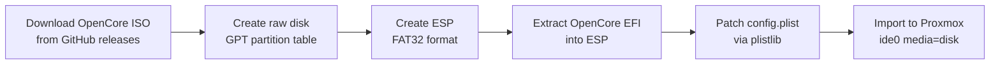

# OpenCore Bootloader

## Why OpenCore is Needed

Proxmox VE uses QEMU/KVM, which does not natively boot macOS. OpenCore is an open-source bootloader that:

- Provides the Apple Secure Boot chain macOS expects
- Injects SMBIOS data so macOS recognizes the VM as genuine Apple hardware
- Loads kernel extensions (kexts) needed for virtualized hardware
- Presents a graphical boot picker with Apple icons

Without OpenCore, the macOS installer kernel panics before reaching the setup screen.

## How the Tool Builds the OpenCore Disk

The OpenCore disk image is built as a **GPT-partitioned disk with an EFI System Partition (ESP)**, not a simple MBR+FAT32 image. This distinction is critical because OVMF firmware (used by Proxmox) cannot reliably boot MBR-formatted media.

### Build Process

The `config.plist` patching is done programmatically via `plistlib` to safely modify XML property lists without risking malformed output.

### Disk Layout

| Proxmox Device | Content         | Format       |
|----------------|-----------------|--------------|
| `ide0`         | OpenCore EFI    | GPT + ESP, `media=disk` |
| `ide2`         | Recovery image  | Raw GPT+HFS+, `media=disk` |
| `virtio0`      | Main disk       | VM storage   |

Boot order: `ide2;virtio0;ide0`

## Required Kexts

Kexts are kernel extensions loaded by OpenCore before macOS boots.

| Kext                  | Purpose |
|-----------------------|---------|
| Lilu                  | Patching framework required by most other kexts |
| VirtualSMC            | Emulates Apple SMC chip; macOS refuses to boot without it |
| WhateverGreen         | GPU/framebuffer patches for display output in VMs |
| CryptexFixup          | Fixes Cryptex (security update) loading on Sonoma 14+ and newer. Without it, boot hangs at `EXITBS:START` |
| AppleALC              | Audio codec support |
| MCEReporterDisabler   | Suppresses Machine Check Exception reports that crash VMs |

### Required Drivers

| Driver               | Purpose |
|----------------------|---------|
| OpenRuntime.efi      | Memory and boot services runtime for OpenCore |
| OpenHfsPlus.efi      | HFS+ filesystem driver (reads macOS recovery partitions) |
| OpenPartitionDxe.efi | Partition map driver for Apple Partition Map and GPT |
| OpenCanopy.efi       | Graphical boot picker with Apple icons |
| ResetNvramEntry.efi  | Adds "Reset NVRAM" option to boot picker |

## Key config.plist Settings

| Setting              | Value    | Purpose |
|----------------------|----------|---------|
| `ScanPolicy`         | `0`      | Scan all disks and filesystems (no filtering) |
| `DmgLoading`         | `Any`    | Allow loading DMG images from any source |
| `Timeout`            | `0`      | Auto-boot the default entry without waiting |
| `csr-active-config`  | `0x0F26` | Disables SIP protections that block kext loading in VMs |

### CryptexFixup and macOS Sonoma+

Starting with macOS Sonoma 14, Apple introduced Cryptex-based security updates. In virtual machines, the Cryptex loading process fails during early boot, causing a hang at `EXITBS:START`. CryptexFixup.kext intercepts this process and applies the necessary patches.

**If you see `EXITBS:START` hang or `Err(0xE)` BootKernelExtensions:** the most likely cause is a missing CryptexFixup kext.

## Common Boot Failures

| Symptom | Cause |
|---------|-------|
| Only "Reset NVRAM" in picker | Wrong recovery image format or missing kexts/drivers |
| `EXITBS:START` hang | Missing CryptexFixup (Sonoma+), SIP still enabled, or MBR-formatted disk |
| `Err(0xE)` BootKernelExtensions | Missing CryptexFixup |
| "No bootable device" | OVMF cannot read MBR+FAT32 as cdrom; must be GPT+ESP with `media=disk` |
