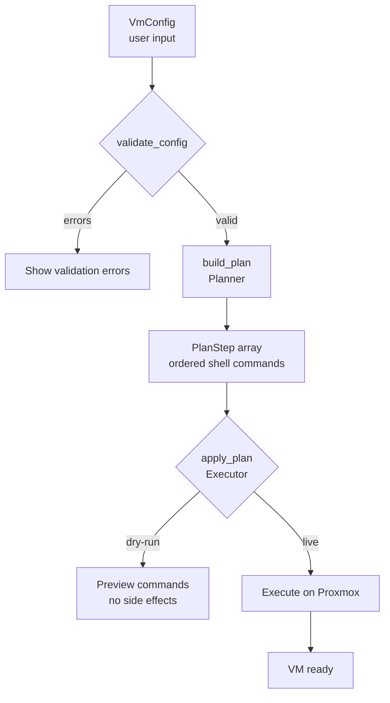
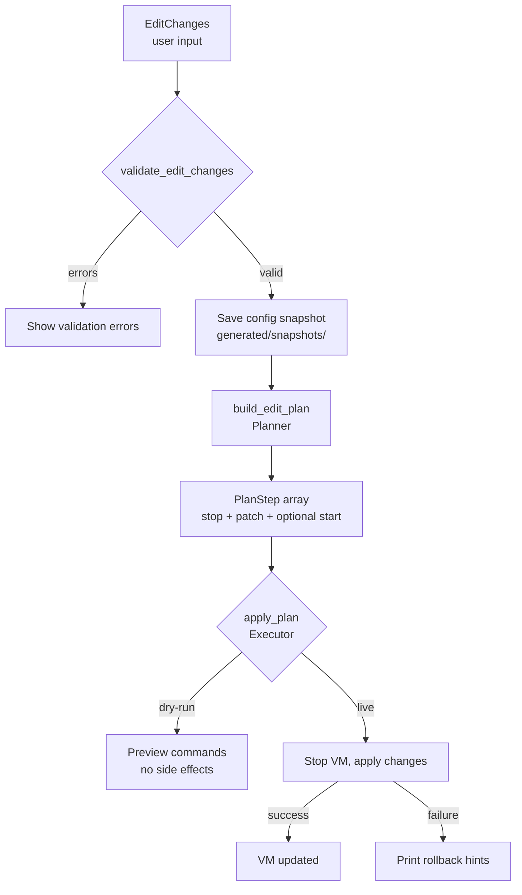

# Architecture Overview

OSX Proxmox Next follows a **plan-then-execute** architecture. User input flows through validation and planning before any Proxmox commands run. This makes dry-run previews possible and keeps side effects isolated to a single executor module.

## Data Flow

### VM Creation



### VM Edit



## Key Domain Types

Defined in `domain.py`:

```python
@dataclass
class VmConfig:
    vmid: int
    name: str
    macos: str          # "ventura" | "sonoma" | "sequoia" | "tahoe"
    cores: int
    memory_mb: int
    disk_gb: int
    bridge: str         # e.g. "vmbr0"
    storage: str
    smbios_serial: str  # auto-generated if empty
    smbios_uuid: str
    smbios_mlb: str
    smbios_rom: str
    smbios_model: str
    net_model: str      # default "vmxnet3"
    # ... additional fields

@dataclass
class EditChanges:
    name: str | None = None         # rename VM
    cores: int | None = None        # new core count
    memory_mb: int | None = None    # new RAM in MB
    bridge: str | None = None       # new network bridge
    disk_gb_add: int | None = None  # extend disk by N GB
    disk_name: str = "virtio0"      # disk device to resize
    nic_model: str | None = None    # None = preserve existing

@dataclass
class PlanStep:
    title: str
    argv: list[str]
    risk: str           # "safe" | "action"

    @property
    def command(self) -> str:
        return shlex_join(self.argv)
```

### Supported macOS Versions

| Key        | Label            | Major Version |
|------------|------------------|---------------|
| `ventura`  | macOS Ventura 13 | 13            |
| `sonoma`   | macOS Sonoma 14  | 14            |
| `sequoia`  | macOS Sequoia 15 | 15            |
| `tahoe`    | macOS Tahoe 26   | 26            |

### Validation Constants

| Constraint    | Value   |
|---------------|---------|
| Min VMID      | 100     |
| Max VMID      | 999999  |
| Min cores     | 2       |
| Min memory    | 4096 MB |
| Min disk      | 64 GB   |
| Bridge format | `vmbr<N>` |

## Module Responsibilities

| Module              | Responsibility |
|---------------------|----------------|
| `domain.py`         | Core types (`VmConfig`, `EditChanges`, `PlanStep`), validation rules, supported OS map |
| `planner.py`        | Converts a `VmConfig` into an ordered `list[PlanStep]` (`build_plan`). Also builds edit plans (`build_edit_plan`) from `EditChanges`, preserving MAC/NIC when changing bridge |
| `executor.py`       | Runs `PlanStep[]` against Proxmox via `ProxmoxAdapter`. Supports dry-run (log only) and live execution. Emits `StepResult` per step with return codes and output |
| `downloader.py`     | Downloads OpenCore ISO from GitHub releases and macOS recovery images from Apple's osrecovery API. Handles retries, progress callbacks, and board-ID mapping per OS version |
| `smbios.py`         | Generates Apple-format serial numbers, MLB with mod-34 checksum, UUID, and ROM. Pure Python, no external binaries |
| `smbios_planner.py` | Builds SMBIOS-related `PlanStep` objects for inclusion in VM creation plans |
| `infrastructure.py` | `ProxmoxAdapter` abstraction for shell command execution on the Proxmox host |
| `defaults.py`       | Hardware detection: CPU vendor, core count, hybrid topology, RAM |
| `rollback.py`       | Config snapshot (saved to `generated/snapshots/` before destructive ops) and rollback hints for manual recovery |
| `diagnostics.py`    | Diagnostic log bundle export |
| `app.py`            | TUI wizard entry point. Composes `_WizardMixin`, `_EditMixin`, and `_ManageMixin` |
| `_wizard_mixin.py`  | TUI 6-step VM creation flow: Preflight, OS selection, Storage, Config, Dry Run, Install |
| `_edit_mixin.py`    | TUI VM edit flow: verifies VM exists, creates snapshot, stops VM, applies `EditChanges`, optionally restarts |
| `_manage_mixin.py`  | TUI manage mode: lists macOS VMs, provides per-VM edit/start/stop/destroy actions |
| `script_renderer.py`| Generates shell scripts for OpenCore disk creation (GPT + ESP partitioning, config.plist patching) |
| `services/`         | Detection service (storage targets, next VMID, VM listing), edit service (worker for applying `EditChanges`) |
| `models/`           | `WizardState` dataclass — reactive TUI state shared across all mixin steps |

## CPU Strategy

The planner selects CPU arguments based on detected hardware:

| CPU Type                    | QEMU `-cpu` Flag         |
|-----------------------------|--------------------------|
| Intel (non-hybrid)          | `host` passthrough       |
| Intel hybrid (12th gen+)    | `Cascadelake-Server`     |
| AMD                         | `Cascadelake-Server`     |
| Intel Xeon                  | `host` passthrough (with `e1000` NIC) |
| Intel pre-Skylake (Penryn)  | `Penryn` emulation (with `e1000` NIC) |
| Manual override             | User-specified model     |

AMD and hybrid Intel use Cascadelake-Server emulation because macOS hardware validation fails on non-standard topologies.

## Executor Results

The executor produces typed results for each step:

```python
@dataclass
class StepResult:
    title: str
    command: str
    ok: bool
    returncode: int
    output: str

@dataclass
class ApplyResult:
    ok: bool
    results: list[StepResult]
    log_path: Path
```

All runs (dry-run and live) are logged to `generated/logs/apply-<timestamp>.log`.
