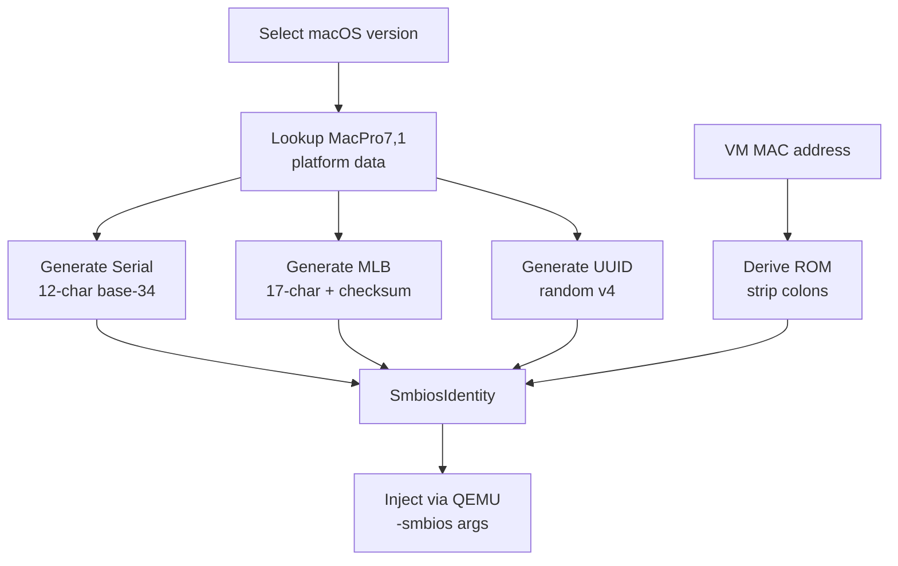

# SMBIOS Identity Generation

## What SMBIOS Identity Is

SMBIOS (System Management BIOS) provides hardware identity data that macOS reads during boot to determine what machine it is running on. macOS uses this data to:

- Select the correct kernel configuration and hardware drivers
- Validate hardware for Apple services (iMessage, FaceTime, iCloud)
- Apply model-specific power management and thermal profiles

In a VM, SMBIOS data must be injected via QEMU arguments so macOS sees a plausible Apple hardware identity. Without valid SMBIOS, macOS boots in a degraded state or refuses to activate services.

## Identity Generation Flow



## Generated Identity Fields

| Field    | Format              | Purpose |
|----------|---------------------|---------|
| Serial   | 12 chars            | Apple hardware serial number |
| MLB      | 17 chars            | Main Logic Board serial (with checksum) |
| UUID     | Standard UUID v4    | Unique machine identifier |
| ROM      | 6-byte hex          | Derived from MAC address |
| Model    | e.g. `MacPro7,1`   | SMBIOS product name |

All fields are represented in the `SmbiosIdentity` dataclass:

```python
@dataclass
class SmbiosIdentity:
    serial: str
    mlb: str
    uuid: str
    rom: str
    model: str
    mac: str = ""
```

## Serial Number Generation

Apple serial numbers follow a 12-character format encoding manufacturing metadata:

```
{country:3}{year:1}{week:1}{line:3}{model_code:4}
```

| Segment      | Length | Source |
|--------------|--------|--------|
| Country code | 3      | Manufacturing location (`C02`, `C07`, `CK2`) |
| Year char    | 1      | Encoded from year via `_YEAR_CHARS` lookup table |
| Week char    | 1      | Encoded from manufacturing week (1-52) using base-34 |
| Line code    | 3      | Production line number (0-3399) encoded as 3 base-34 digits |
| Model code   | 4      | Hardware model identifier (e.g. `P7QM` for MacPro7,1) |

### Base-34 Alphabet

Apple uses a 34-character alphabet that excludes `I` and `O` to avoid ambiguity:

```
0123456789ABCDEFGHJKLMNPQRSTUVWXYZ
```

### Year and Week Encoding

Year characters cycle every 10 years from 2010 using the lookup table `CDFGHJKLMN`. Weeks 1-26 use the base year character; weeks 27-52 advance the year character by one position. The week position within the half-year is encoded as a base-34 digit.

### Production Line Encoding

The production line number (0-3399) is encoded as three base-34 digits using standard positional encoding:

```python
d1 = line // (34 * 34)
d2 = (line // 34) % 34
d3 = line % 34
```

## MLB Generation

The Main Logic Board serial is a 17-character string with a built-in checksum:

```
{country:3}{year_dec:1}{week_dec:2}{block1:3}{block2:2}{board:4}{block3:2}
```

| Segment   | Source |
|-----------|--------|
| Country   | Same manufacturing location as serial |
| Year/Week | Decimal-encoded manufacturing date |
| Block1    | Random from pool (`200`, `600`, `403`, `404`, etc.) |
| Block2    | Random from pool (`Q0`-`QZ` in base-34) |
| Board     | Board code for the model (e.g. `K3F7` for MacPro7,1) |
| Block3    | Computed analytically to satisfy mod-34 checksum |

### Mod-34 Checksum

The checksum uses an alternating weight scheme (3/1) across all characters:

```python
def _verify_mlb_checksum(mlb: str) -> bool:
    checksum = 0
    for i, ch in enumerate(mlb):
        j = BASE34.index(ch)
        weight = 3 if ((i & 1) == (len(mlb) & 1)) else 1
        checksum += weight * j
    return checksum % 34 == 0
```

The final two characters (`block3`) are computed so the total weighted sum is divisible by 34. This matches the format Apple uses for genuine MLB serials.

## ROM Derivation

The ROM field is a 6-byte value derived from the VM's MAC address by stripping the colon separators:

```
MAC: AA:BB:CC:DD:EE:FF -> ROM: AABBCCDDEEFF
```

This ties the SMBIOS identity to the VM's network interface, which macOS uses for hardware binding in Apple services.

## Pure Python Implementation

The entire SMBIOS generation is implemented in Python using only standard library modules (`secrets`, `string`, `uuid`). There is no dependency on the external GenSMBIOS binary or any macOS-specific tools. All randomness uses `secrets` for cryptographic quality.

### Platform Data

Model-specific manufacturing data is stored in `APPLE_PLATFORM_DATA`:

| Model       | Country Codes   | Year Range | Board Code |
|-------------|-----------------|------------|------------|
| MacPro7,1   | C02, C07, CK2   | 2019-2023  | K3F7       |

All supported macOS versions (Ventura through Tahoe) use `MacPro7,1` as the SMBIOS model.
